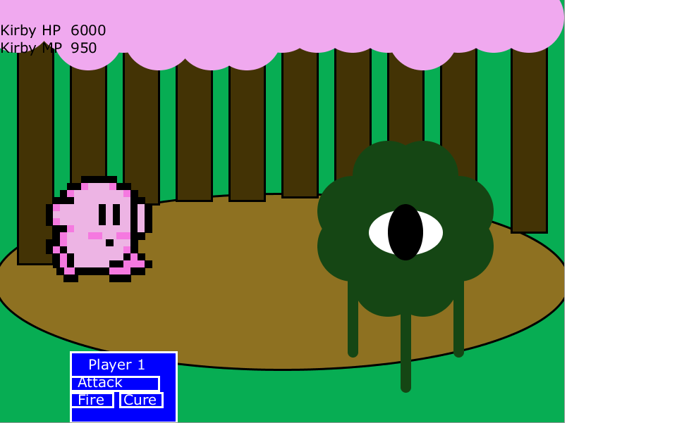
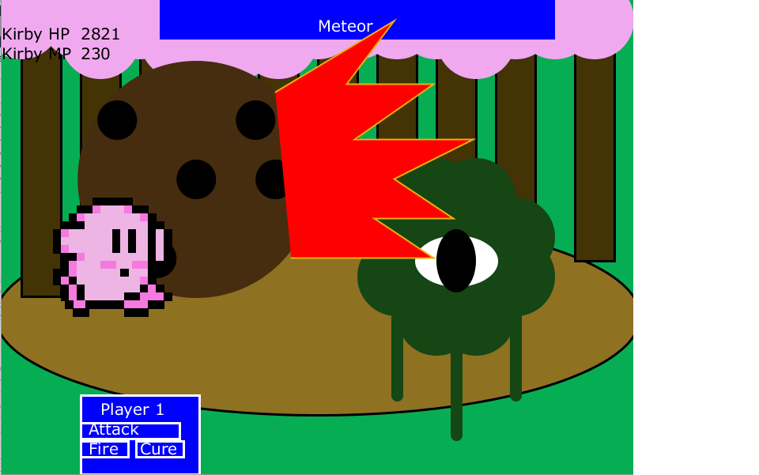

# Kibry-RPG-
Short RPG Boss Battle with Kibry, made in Processing, uses Active Battle Time.

Active Battle Time(ATB)- RPG system populared by games such as Final Fantasy 7, key characteristics are that both you and your enemy take have a time gauge that fills up, and when it does you can attack or make a move. Your time bar and your enemies time bar continue regardless of what the other party chooses to do.

CONTROLS 
_____________________________________
MOUSE CLICKS ONLY

MENU EXPLANATION 
_____________________________________
Attack - Simple low damage phyiscal tackle. Costs no mp
Cure - Magic that depletes MP to cure some HP.
Fire - Strong fireball that does a lot of damage, but has a moderately high MP cost.

SCREENSHOTS
____________________________________

;
;
;
